# Italy-Macro-analysis

Macroeconomic analysis of Italy from 1995 to 2023 with R

[View the code used](code.R)

|       | NOMINAL GDP | DEFLATOR | INFLATION | UNEMPLOYMENT | GINI INDEX | NET LENDING_BORROWING | INTEREST PAYABLE | GROSS DEBIT | TOTAL EXPENDITURE | TOTAL REVENUE |
|-------|-------------|----------|-----------|--------------|------------|-----------------------|------------------|-------------|-------------------|---------------|
| Min.  | 988243      | 59912    | 68.50     | 7.90         | 29.00      | -9.400                | 3.400            | 103.9       | 46.50             | 43.20         |
| 1st Qu.| 1350259     | 79567    | 79.55     | 8.70         | 31.73      | -4.200                | 4.100            | 108.9       | 47.30             | 44.40         |
| Median| 1612751      | 93666    | 91.85     | 10.25        | 32.40      | -3.000                | 4.600            | 119.2       | 49.10             | 45.70         |
| Mean  | 1530043      | 90528    | 90.92     | 10.25        | 32.00      | -3.976                | 5.266            | 122.2       | 49.81             | 45.83         |
| 3rd Qu.| 1661240     | 101134   | 100.33    | 11.60        | 32.77      | -2.600                | 5.400            | 134.5       | 51.00             | 47.40         |
| Max.  | 2085376     | 116585   | 120.90    | 12.90        | 33.40      | -1.300                | 11.100           | 155.0       | 56.80             | 48.10         |

|                            | NOMINAL GDP | DEFLATOR | INFLATION | UNEMPLOYMENT | GINI INDEX | NET LENDING_BORROWING | INTEREST PAYABLE | GROSS DEBIT | TOTAL EXPENDITURE | TOTAL REVENUE |
|----------------------------|-------------|----------|-----------|--------------|------------|-----------------------|------------------|-------------|-------------------|---------------|
| NOMINAL GDP                | 1.00        | 0.88     | 0.89      | -0.10        | 0.54       | -0.47                 | -0.46            | 0.51        | 0.48              | 0.18          |
| DEFLATOR                   | 0.88        | 1.00     | 0.96      | 0.12         | 0.60       | -0.61                 | -0.61            | 0.85        | 0.68              | 0.45          |
| INFLATION                  | 0.89        | 0.96     | 1.00      | 0.23         | 0.60       | -0.49                 | -0.38            | 0.75        | 0.60              | 0.55          |
| UNEMPLOYMENT               | -0.10       | 0.12     | 0.23      | 1.00         | 0.43       | 0.50                  | 0.13             | 0.32        | -0.26             | 0.63          |
| GINI INDEX                 | 0.54        | 0.60     | 0.60      | 0.43         | 1.00       | 0.09                  | -0.41            | 0.53        | -0.01             | 0.23          |
| NET LENDING_BORROWING      | -0.47       | -0.61    | -0.49     | 0.50         | 0.09       | 1.00                  | 0.42             | -0.57       | -0.96             | -0.22         |
| INTEREST PAYABLE           | -0.46       | -0.61    | -0.38     | 0.13         | -0.41      | 0.42                  | 1.00             | -0.64       | -0.33             | 0.14          |
| GROSS DEBIT                | 0.51        | 0.85     | 0.75      | 0.32         | 0.53       | -0.57                 | -0.64            | 1.00        | 0.69              | 0.60          |
| TOTAL EXPENDITURE          | 0.48        | 0.68     | 0.60      | -0.26        | -0.01      | -0.96                 | -0.33            | 0.69        | 1.00              | 0.49          |
| TOTAL REVENUE              | 0.18        | 0.45     | 0.55      | 0.63         | 0.23       | -0.22                 | 0.14             | 0.60        | 0.49              | 1.00          |

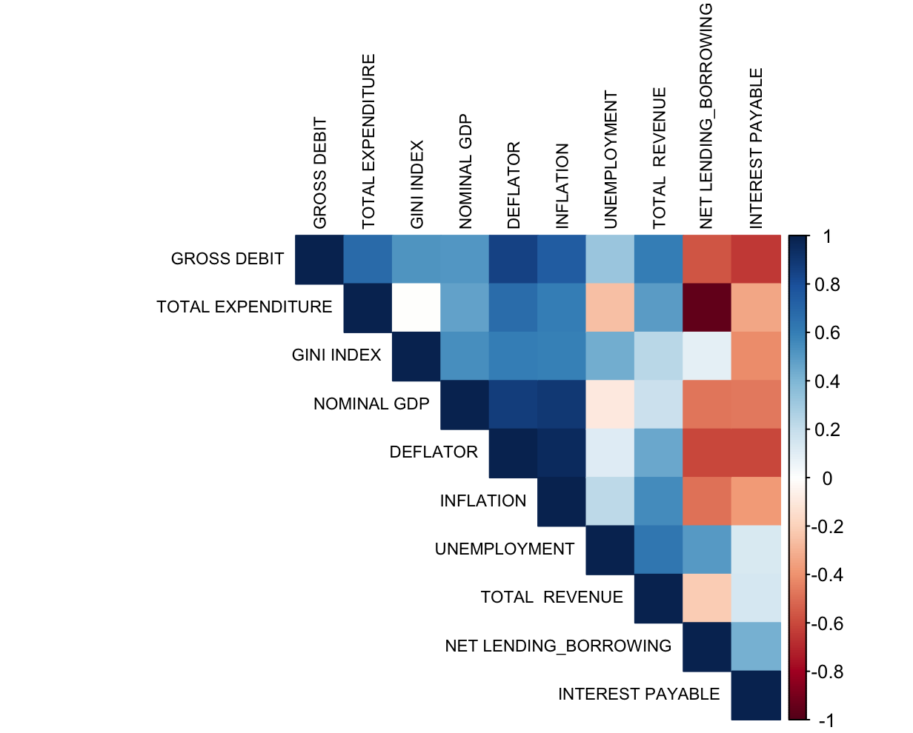
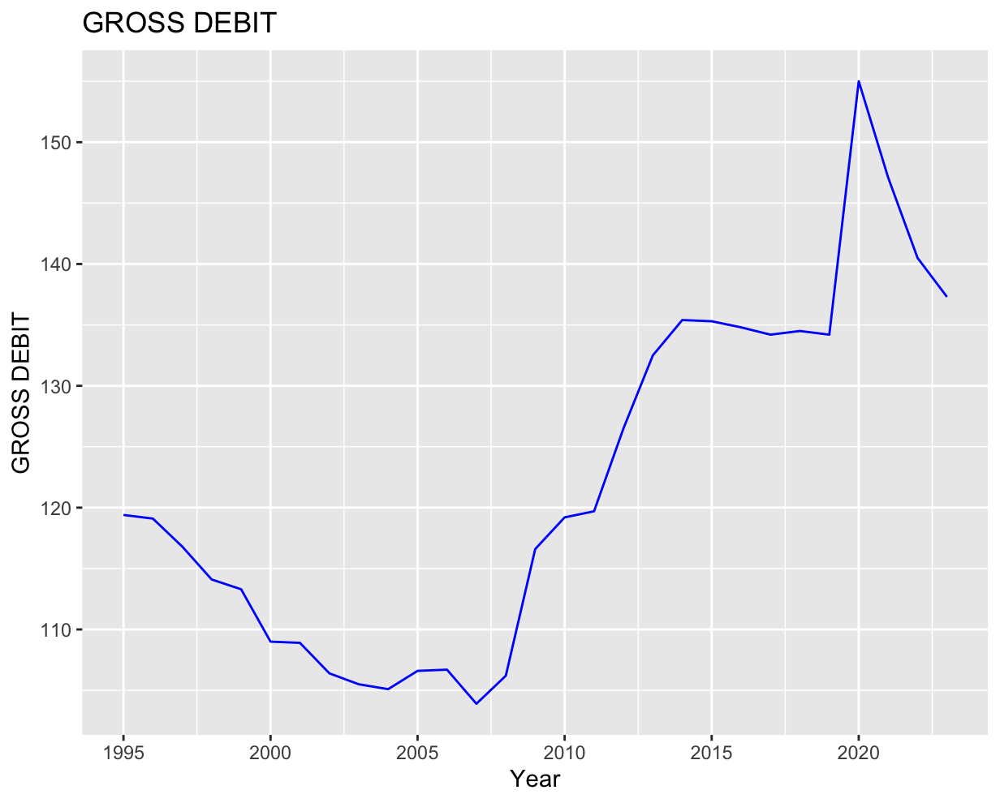
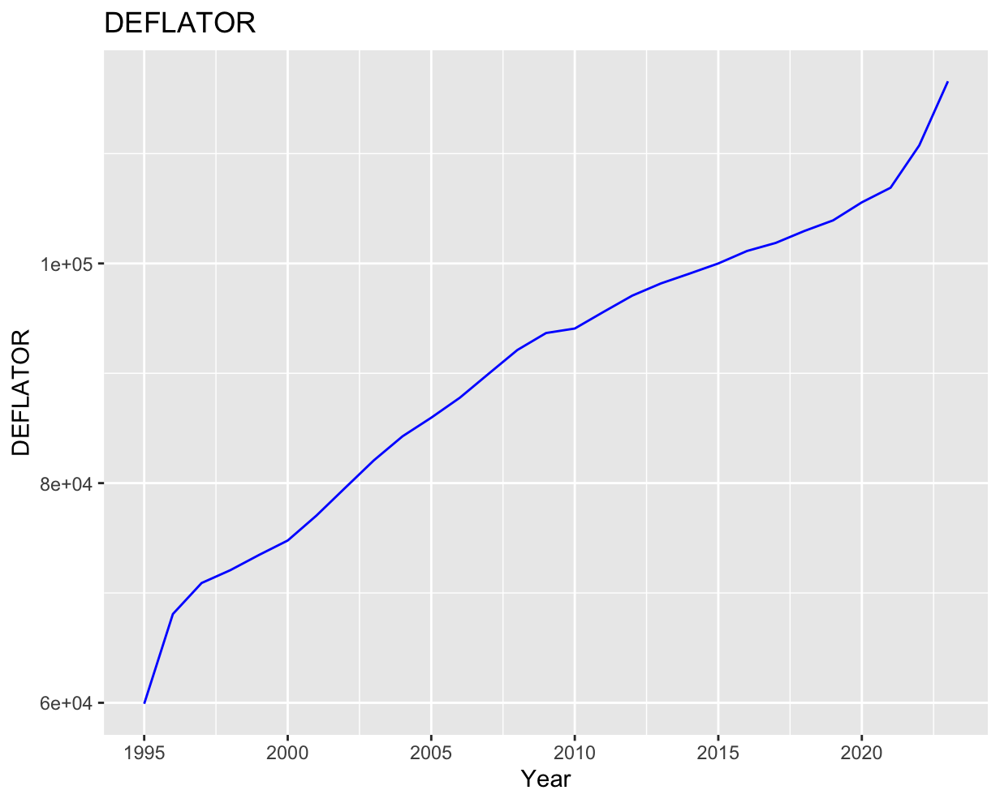
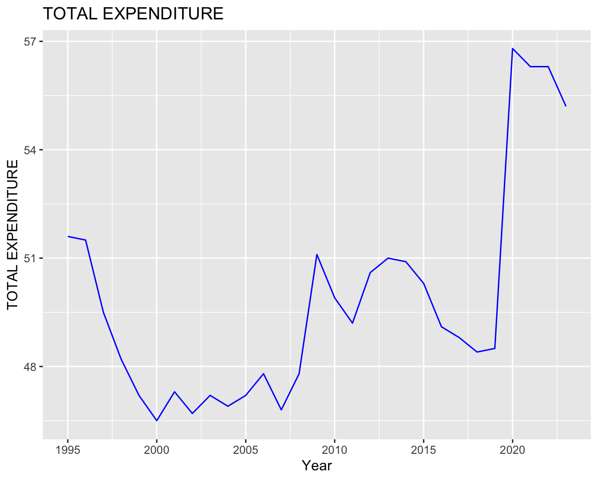
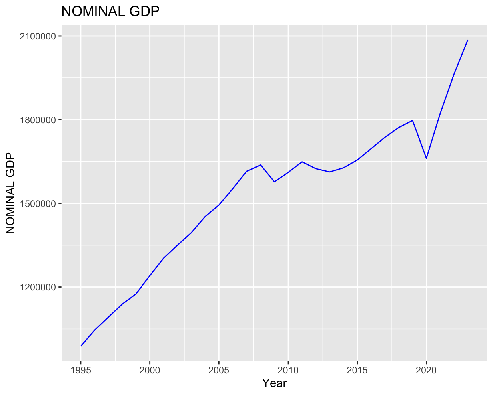
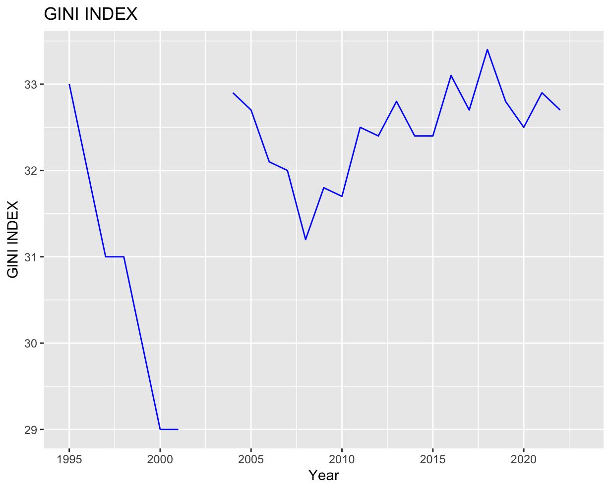
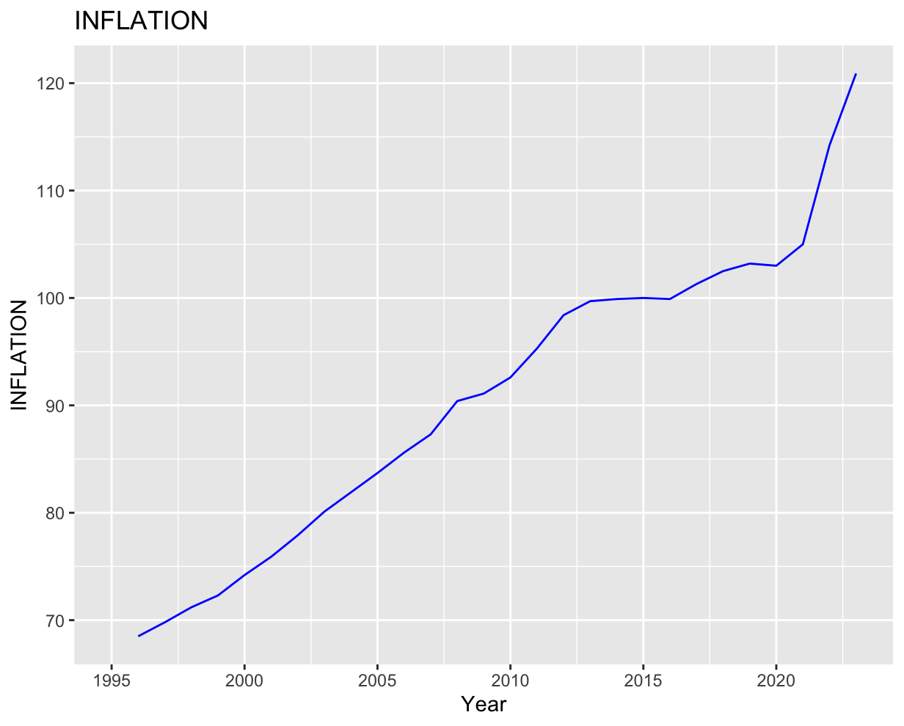
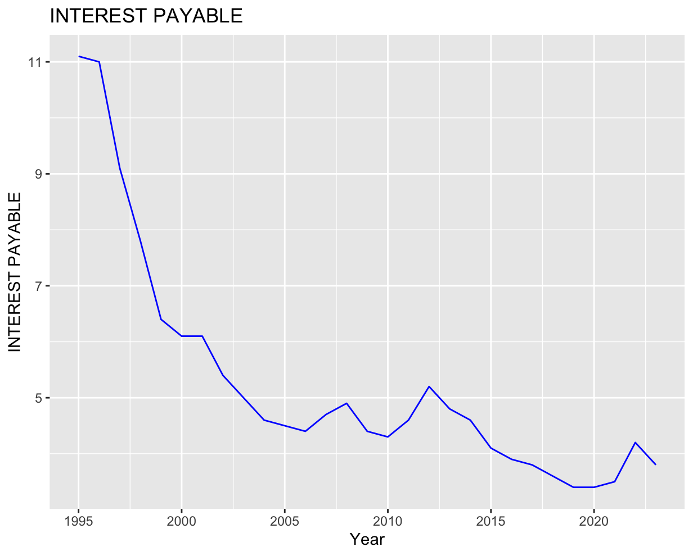
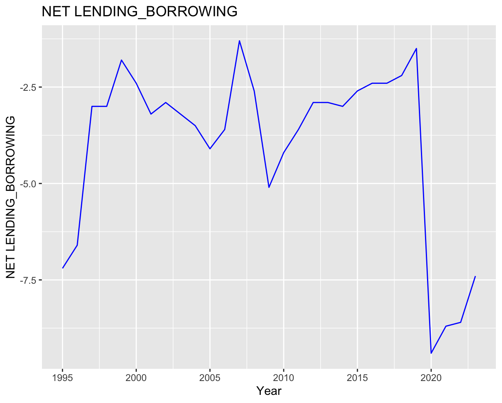
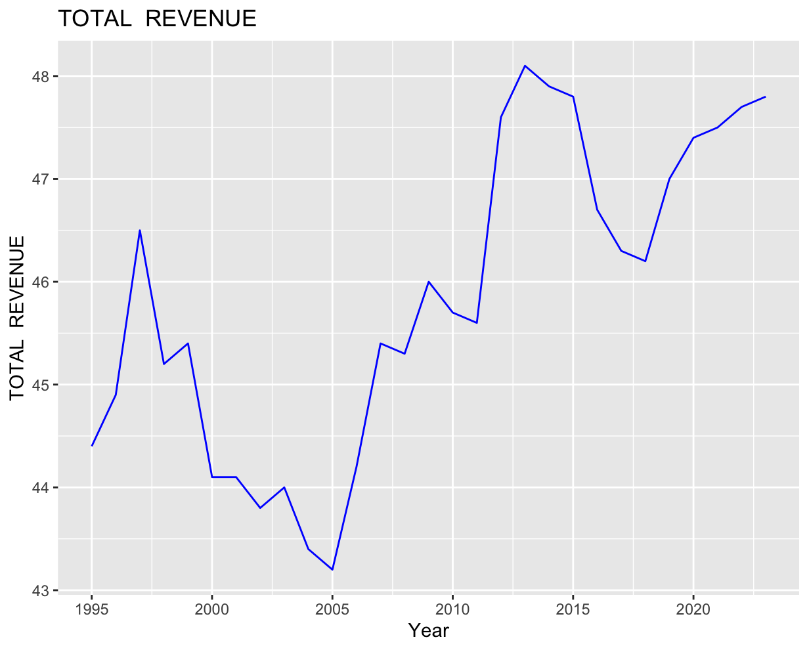
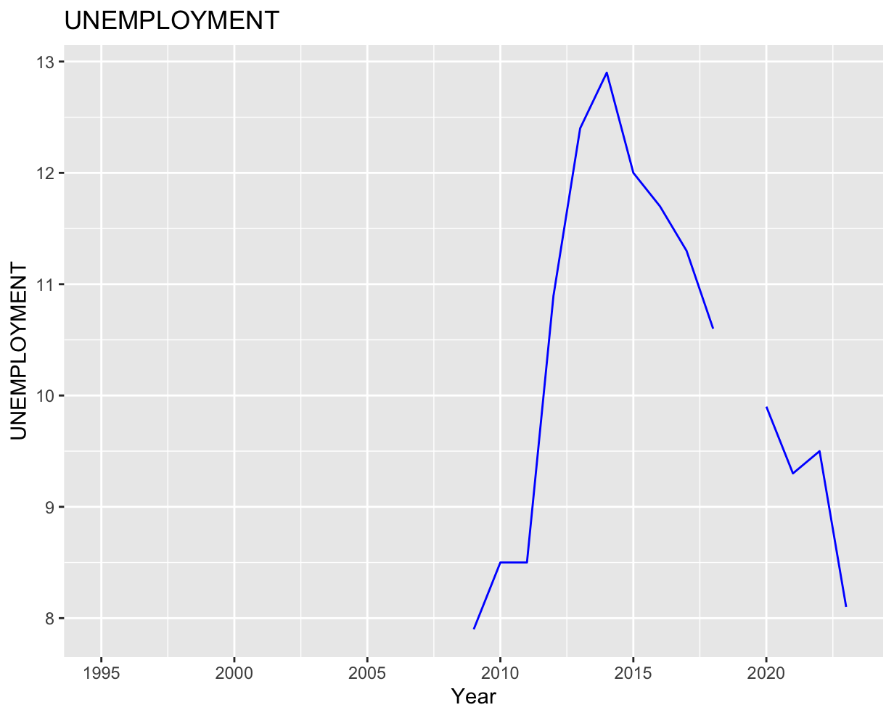
